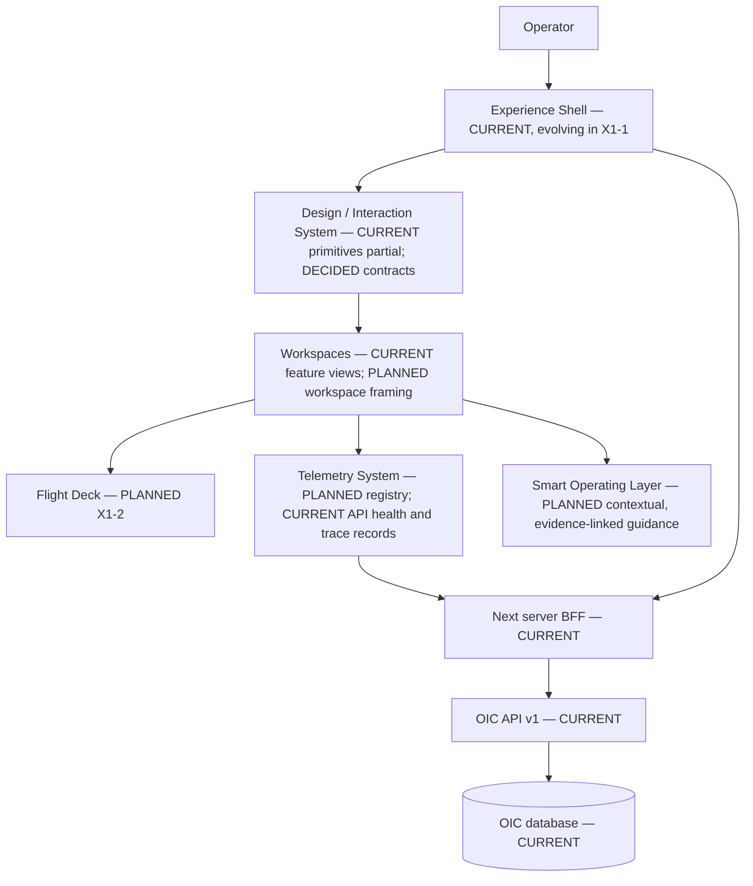
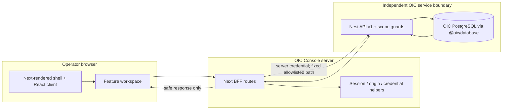
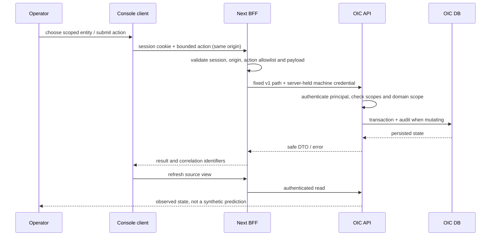
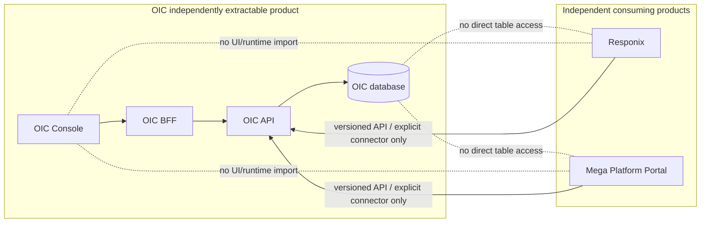
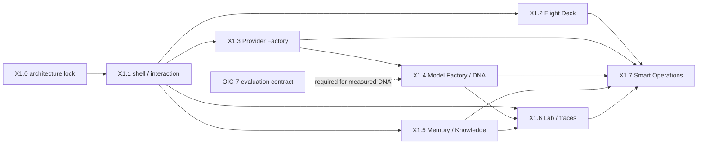

# OIC-X1 Architecture Lock

**Status:** DECIDED architecture; current implementation facts are labeled CURRENT; delivery work remains PLANNED or DEFERRED. **Scope:** OIC only. **Baseline:** `aa50e61`.

## Product intent

**DECIDED — OIC Intelligence Operating Environment.** OIC is the operator environment for configuring and observing OIC-owned identity, provider and model fabric, intelligence profiles, memory, knowledge, execution and health. Primary personas are OIC platform operators, provider/model administrators, intelligence engineers, and audit/readiness operators. Customer applications remain clients of OIC contracts; this Console is not their workspace.

**DECIDED principles:** independent by design; unified by default; separable without redesign; workspace-first; progressive disclosure; visible causality; real-data-only; least privilege; EN/AR with LTR/RTL; live owner preview. An operator must be able to trace a visible state to an OIC source, freshness, scope, and permitted action. Never fill missing observations with illustrative live-looking numbers.

## Boundaries and non-goals

**CURRENT:** OIC has its own Nest API, `@oic/database`, contracts, runtime plane, and Next Console in this repository. Its database URL validator requires an OIC-named database and role. OIC and Responix are peer products. **DECIDED:** no cross-product tables, direct runtime imports, hidden coupling, shared product components, or credential exposure to the browser. Oi Home is outbound navigation only. **DEFERRED:** separate repository/server extraction is not required now; architecture must not prevent it.

**Non-goals:** X1 does not implement cognitive autonomy, hidden chain-of-thought inspection, fabricated observability, product billing/economics, or Flight Deck instruments before X1-2. Do not start X1-2 work under X1.0.

## Human operating environment

**DECIDED:** global navigation selects a domain; a Workspace Frame then keeps entity list, detail, controls, relationships and technical inspection together. Put high-frequency state first; progressive disclosure moves from summary to domain, entity and raw safe diagnostics. Causality links action → accepted change → observable reaction; distinguish known, predicted and unknown impact. Advisor surfaces are contextual and source-linked, not a generic chatbot.

## Layers and delivery truth

**CURRENT:** this is a conceptual architecture, not a claim that all named layers or registries exist in code. Console and API preview processes are required to remain independently live at `localhost:3002` and `127.0.0.1:4100` during work; keep their terminals separate. No library is added by X1.0.

## Implementation contract

### Mission and mental model

**DECIDED:** the Console exists to let an authorized operator understand and safely change OIC itself. It answers four questions: what is configured, which scope owns it, what will an action affect, and what did the system actually do afterward? The six global domains are the operator's mental model: COMMAND (orientation and global search), FOUNDATION (applications and identity), FACTORY (providers and model assembly), INTELLIGENCE (profiles, memory and knowledge), LAB (controlled execution and traces), OPERATIONS (health and audit). Do not use a generic customer-tenant dashboard mental model.

### Ownership and data flow

| Layer | CURRENT owner / source | Contract and future consumer |
|---|---|---|
| Experience shell | `apps/oic-console/app/console-app.tsx`, `app/page.tsx`, `app/layout.tsx` | Own operator session presentation, global navigation and view state; X1-1 evolves it. No domain policy or direct database access. |
| Design / interaction | `app/styles.css`, `app/components/oic-controls.tsx`; X1-1 adds `oic-frames.tsx`, `oic-primitives.tsx` | Semantic controls and visual tokens; workspaces compose, never bypass BFF/API. |
| Feature workspaces | `app/features/{identity,providers,model-fabric,intelligence,overview,runtime,operations}/` | Own page-specific composition and client state; consume typed/sanitized BFF responses. |
| BFF / server auth | `app/api/{session,console,action}/route.ts`, `lib/server-auth.ts` | Check operator session, same-origin on mutations, map allowlisted view/action to fixed API paths, attach server-only credential, bound payload/timeout, return safe JSON. |
| OIC API | `apps/oic-api/src/modules/{identity,control-plane,intelligence,runtime-plane,health}/` | Authenticate machine principal and authorize scopes; own domain validation, transactions, audit and safe response DTOs. |
| Persistence | `packages/oic-database/prisma/schema.prisma` | OIC-only records and migrations; no Console query or other product database access. |

**DECIDED data boundary:** browser requests never contain machine credentials. The Console BFF is a same-product server adapter, not a source of domain truth. API authorization remains authoritative even after Console session checks. The API owns app/tenant scope, provider credential custody, effective binding resolution, state transitions and audit. Response serializers must omit encrypted credential fields and unsafe runtime payloads.

The dotted edges explicitly represent prohibited paths, not runtime interactions. Responix and Portal remain external products; this pass changes neither.

### Extension philosophy and anti-patterns

**DECIDED:** add domain data by extending API-owned contracts, then BFF allowlist, then typed UI view model, then workspace/registry presentation. Add a metric without editing Overview layout; add an instrument without changing source normalization. Version contracts explicitly and keep unknown values inspectable. New capabilities must declare owner, scope, lifecycle, source, failure states and acceptance before UI work.

**Anti-patterns:** browser-to-API machine credential exposure; client-side authorization; BFF pass-through of arbitrary URLs; query-building SQL in Console; generic global CRUD forms; optimistic success without API confirmation; fake telemetry; profile settings presented as quality; color-only status; hidden auto-apply; direct imports from Responix or Portal; shared database reads; speculative APIs documented as current.

### Dependency map

**Hard stops:** any proposed weakening of session, origin/CSRF, API machine identity, scopes, tenant/application isolation, dedicated OIC DB validation, secret filtering, audit trail or product boundaries stops implementation for review. No page-level convenience may override an API denial.

## Architecture lock version

**OIC-X1 ARCHITECTURE LOCK VERSION: 1.0 — STATUS: LOCKED.** This lock becomes effective after the X1.0C GO gate. Implementation follows the linked contracts, including [live/temporal state](21_OIC_LIVE_STATE_AND_TEMPORAL_ARCHITECTURE.md), [commands/events](22_OIC_ACTION_COMMAND_EVENT_ARCHITECTURE.md), [permission-aware UX](23_OIC_PERMISSION_AWARE_OPERATOR_UX.md), [recovery](24_OIC_FAILURE_RECOVERY_AND_ROLLBACK.md), [performance](25_OIC_FRONTEND_PERFORMANCE_AND_DENSITY.md), [compatibility](26_OIC_VERSIONING_CAPABILITY_AND_COMPATIBILITY.md), and [visual acceptance](27_OIC_VISUAL_ACCEPTANCE_GOVERNANCE.md). Any later architecture change requires an explicit decision-log amendment; implementation may not diverge ad hoc. Current implementation facts and milestone status remain distinct from the locked target contracts.
