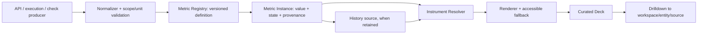

# OIC Telemetry and Instrument Architecture

**Runtime interaction contract:** see [live state and temporal semantics](21_OIC_LIVE_STATE_AND_TEMPORAL_ARCHITECTURE.md), [performance/density](25_OIC_FRONTEND_PERFORMANCE_AND_DENSITY.md), [versioning and availability](26_OIC_VERSIONING_CAPABILITY_AND_COMPATIBILITY.md), and [visual evidence](27_OIC_VISUAL_ACCEPTANCE_GOVERNANCE.md). One shared, bounded acquisition cycle supplies many instruments; never one endpoint call or polling loop per instrument. Snapshot data is not historical trend. Do not use animated placeholders as live data, and never show a stale value as live without its timestamp/state.

## Pipeline

**DECIDED target:** `OIC-owned data sources → normalization → Metric Registry → metric state → Instrument Registry → deck layout → operator interaction`. Sources remain authoritative in API/domain services. Normalization adds labels, units, source and freshness without fabricating data. Registry metadata is separate from renderer and layout. **CURRENT:** there is no runtime Metric Registry or Instrument Registry. Current health endpoint reports process live and readiness with database check; execution records contain bounded counts, status, timestamps, summary and stage metadata. These are different source classes.

## Metric contract

**DECIDED conceptual contract:** `{key, domain, entityType, entityId?, label, description, value?, unit, state, range?, thresholds?, trend?, confidence?, source, freshness, historyCapability, visualizationHint, drilldown, maturity, schemaVersion}`. Missing values stay missing. `source` identifies API endpoint/service/entity and scope; freshness reports observed time or unavailable, never a synthetic timestamp. `confidence` is only provided by a source with defined semantics; otherwise omitted. Trend/history requires actual timestamped samples, not repeated snapshots.

States: `LIVE` observed and fresh; `IDLE` source is available and no activity/value is expected; `UNAVAILABLE` source cannot provide a value; `DEGRADED` partial/stale service with known reason; `FAULT` explicit source error. State is separate from maturity:

| Maturity | Meaning |
|---|---|
| `LIVE_NOW` | Directly returned by a current OIC source with aligned unit/scope. |
| `DERIVED_NOW` | Deterministically calculated from current, cited source values; formula is inspectable. |
| `PLANNED` | Requires API, storage, evaluator, or event contract not present today. |
| `EXTENSIBLE` | Registry can accept a future definition; no current value is claimed. |

## Instrument Registry and growth

**DECIDED:** instrument definition owns renderer family, accessible fallback, unit/range semantics, supported states, density, RTL behavior and version. Families: radial, arc, numeric, capacity rail, vertical pressure, sparkline, temporal chart, distribution, heatmap, matrix, timeline, topology, DNA, future plugin. Registry selection matches metric maturity/state and hint; no renderer computes new telemetry.

New model/provider surfaces are derived by entity type and available metric definitions. A new metric adds a catalog definition, source adapter, schema/version and tests without redesigning Overview. New renderers register against the contract without changing source adapters. Unknown metric/instrument versions degrade to labeled technical data, not dropped or invented values. **PLANNED:** persisted user layouts and arbitrary plugin installation are deferred; initial layouts remain product-owned and curated.

## Source ownership and data path

| Concern | CURRENT owner/source | Future consumer and expected contract |
|---|---|---|
| API health | `apps/oic-api/src/modules/health/health.controller.ts` | Health/Overview reads process live and readiness with database check; no CPU or service SLO implied. |
| Control-plane snapshot | `apps/oic-api/src/modules/control-plane/console-snapshot.controller.ts` | Overview and workspace summaries use returned OIC record counts/entities with generated time; counts are not runtime performance. |
| Execution summary/stages | `packages/oic-database/prisma/schema.prisma` (`OicIntelligenceExecution`, `OicIntelligenceExecutionStage`); readers in `apps/oic-api/src/modules/intelligence/intelligence-profile.service.ts` and `intelligence.controller.ts` | Lab/Trace/Flight Deck can consume stored fields through allowlisted BFF; per-execution sample is not a fleet rate. |
| Provider check/catalog evidence | `OicProviderHealthCheck`, `OicProviderSyncRun`, upstream evidence models; control-plane provider services/controllers | Provider Factory and deck consume latest timestamp/status and explicit latency where API returns it; trend requires querying retained history. |
| Console transport | `apps/oic-console/app/api/console/route.ts`; `app/console-app.tsx` | Client views use BFF JSON. The BFF must not infer measurement semantics or become a telemetry database. |

## Formal definition and instance rules

`MetricDefinition` conceptual shape: `{key, version, domain, entityType, labelKey, descriptionKey, unit, valueType, normalRange?, thresholdModel?, visualizationHints[], historySupport, drilldownContract, owner, maturity}`. Definition identity is `(key, version)`. Units, meaning, aggregation denominator and threshold interpretation are breaking changes; create a new major version/key. Definitions are product-owned and immutable after publish. Discovery groups by domain/entity type and stable priority; registration comes from OIC-owned code or versioned API schema, never arbitrary browser plugins.

`MetricInstance` conceptual shape: `{metricKey, definitionVersion, entityId?, value?, state, confidence?, freshness:{observedAt?, staleAfterMs?, isStale}, source:{service, endpointOrRecord, scope}, sampleSize?, timeWindow?, updatedAt}`. Identity is `(metricKey, entityType, entityId, scope, timeWindow?)`. Require denominator/sample size when the aggregate's interpretation depends on cohort size. Confidence is omitted unless the producer defines calibration. `updatedAt` is source time, not page render time.

Normalizer validates scope, entity identity, type, unit, source timestamp and numeric domain. Malformed samples are rejected to safe diagnostics, not coerced or silently clamped. A derived value records formula/version and input references. If a required input is missing/stale, the derived instance inherits unavailable/degraded per formula policy. `DERIVED_NOW` is maturity, not state.

## State and freshness

- `LIVE`: a source observation exists within its declared freshness threshold.
- `IDLE`: source is reachable and entity valid, with no activity/value expected. It is not zero unless the source value is literally zero.
- `UNAVAILABLE`: no observation could be produced; value is null.
- `DEGRADED`: partial observation or last known observation is past freshness threshold; retain its value only with stale marker, reason and observed time.
- `FAULT`: source returned a classified error or invariant violation; expose safe code/correlation only.

Stale is metadata, not a sixth state: use `DEGRADED` for a known but old observation; use `UNAVAILABLE` if no observation was ever returned. Do not overwrite last-known value with zero. Missing thresholds mean “not configured,” not healthy. Availability timeout and empty successful query remain different states.

## Instrument renderer contracts

For every renderer provide compact and expanded forms; source state and textual value remain available at both sizes. Renderer never calculates telemetry.

| Renderer | Good / bad semantic use and data needed | Offline / fault | Compact / expanded; drilldown |
|---|---|---|---|
| RADIAL | Bounded ratio with range/thresholds; bad for unbounded counts or unnamed score | Neutral empty ring with state text / fault code | Numeric center / add ticks, range, source; link to definition |
| ARC | Bounded one-dimensional range; bad as decoration implying motion | Empty arc and unavailable label | Value and unit / scale and thresholds; keyboard link only if actionable |
| NUMERIC | Count/scalar/duration with unit; bad without denominator | Em dash + explicit state | Value / add source, time, window; link with name |
| CAPACITY_RAIL | Used/limit same scope; bad without owned limit | Unfilled unavailable rail | Used and max / formula and policy link |
| VERTICAL_PRESSURE | Ordered load where high/low meaning defined; bad for uncalibrated health | Neutral unfilled scale | Current marker / thresholds and direction; numbers do not reverse in RTL |
| SPARKLINE | Timestamped ordered samples; bad repeated snapshots | Gap remains gap, offline state labeled | Range summary / axes, sample window, accessible text table |
| TEMPORAL | Retained timestamped measurements; bad for instantaneous snapshots | Missing intervals explicit | Window summary / axes, range query, source time; only enable ranges backend supports |
| DISTRIBUTION | Cohort with denominator/bucket definition; bad for one entity | No cohort message | Quantile/bin summary / labeled bins; only filter if API supports same cohort |
| HEATMAP | Two meaningful axes with provenance; bad rainbow or color-only status | Missing cell distinct from zero | Small labeled cells / legend + table; keyboard grid if interactive |
| MATRIX | Explicit row-column relation/state; bad implicit similarity without method | Unknown cell explicit | State glyph / row/column labels; link to relation source |
| TIMELINE | Persisted ordered events; bad predicted mixed with actual | Gaps/query failure explicit | Key milestones / time scale and source; chronological screen-reader order |
| TOPOLOGY | API-owned versioned scoped edges; bad inferred/cross-scope edges | Partial result flagged, not “no neighbors” | Node list / bounded graph and edge provenance; list remains accessible |
| DNA | Evaluator-owned versioned dimensions; bad control settings as ability | Partial dimensions marked unmeasured | Labeled table / optional compatible comparison plot; link evaluator evidence |

Unknown metric: register its definition, adapter, source/freshness/unit policy, renderer hint, contract tests and drilldown. Overview obtains grouped descriptors so a new metric appears in the correct entity deck without metric-specific page code. Unknown renderer: implement resolver capability match plus all state fallbacks; do not alter producers or definitions. Unknown model/provider receives only registered metrics for its entity type and permitted scope. Arbitrary plugin code and user-defined layouts are **DEFERRED**.
