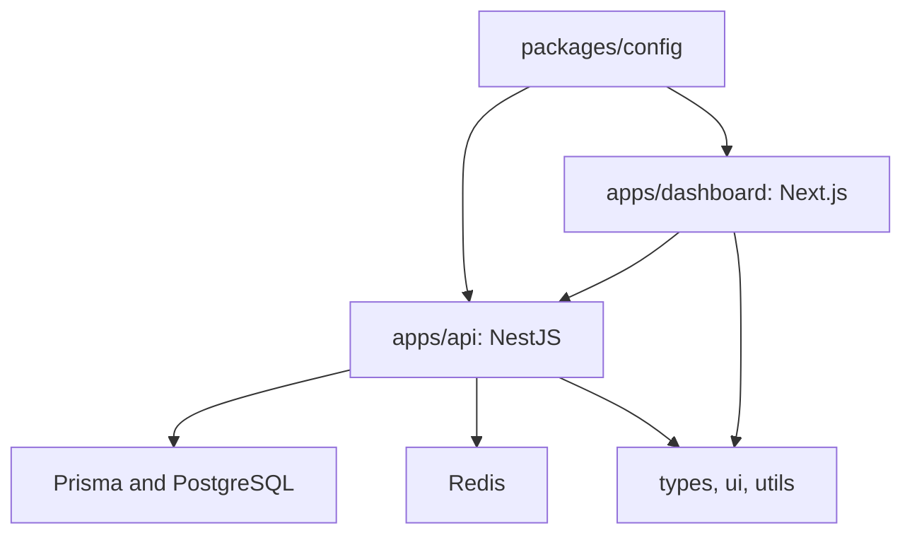

# Responix AI Context

## Project Name and Goal

| Item              | Current state                                                                       |
| ----------------- | ----------------------------------------------------------------------------------- |
| Project name      | Responix                                                                            |
| Goal              | Enterprise multi-tenant AI customer-engagement platform.                            |
| Version           | `0.0.0` private, unreleased workspace package.                                      |
| Development model | Sprint-based and core-first.                                                        |
| Source of truth   | `MASTER_CODEX_PROMPT.md` and relevant files in `Official Technical Documentation/`. |

Do not redesign documented architecture or infer requirements absent from the active sprint request and official documentation.

## Project-State Reading Map

This file is the entry point for repository memory. Read the linked documents in this order before implementation:

1. [AI_BOOTSTRAP.md](AI_BOOTSTRAP.md) — concise onboarding rules.
2. [SESSION_HANDOFF.md](SESSION_HANDOFF.md) — immediate session state and next action.
3. [KNOWN_ISSUES.md](KNOWN_ISSUES.md) — active constraints and blockers.
4. [ENGINEERING_WORKFLOW.md](ENGINEERING_WORKFLOW.md) — required engineering process.
5. [AI_RULES.md](AI_RULES.md) — permanent non-negotiable rules.
6. [PROJECT_VERSION.md](PROJECT_VERSION.md) — repository/version dashboard.
7. [VALIDATION_HISTORY.md](VALIDATION_HISTORY.md) — historical validation evidence.
8. [ROADMAP_STATUS.md](ROADMAP_STATUS.md) — approved delivery sequence.
9. [ARCHITECTURE_DECISIONS.md](ARCHITECTURE_DECISIONS.md) and [PROJECT_GLOSSARY.md](PROJECT_GLOSSARY.md) — decisions and terminology.

## Architecture Summary

| Area                    | Current technology                                                        |
| ----------------------- | ------------------------------------------------------------------------- |
| Language                | Strict TypeScript                                                         |
| Workspace               | pnpm 9 workspaces and Turborepo                                           |
| Dashboard               | Next.js 15, React 19, Tailwind CSS                                        |
| API                     | NestJS 11, Swagger/OpenAPI, Terminus, Pino; rate limiting and compression |
| Data                    | Prisma 6, PostgreSQL with pgvector                                        |
| Cache and queues        | Redis; BullMQ is installed in the API foundation                          |
| Object storage contract | Cloudflare R2 environment variables                                       |
| Local orchestration     | Docker Compose                                                            |
| Quality                 | ESLint 9, Prettier 3, TypeScript                                          |

## Repository Structure

| Path                                              | Purpose                                                                     |
| ------------------------------------------------- | --------------------------------------------------------------------------- |
| `apps/api`                                        | NestJS API, configuration validation, Swagger, URI-versioned health module. |
| `apps/dashboard`                                  | Next.js dashboard foundation and route groups.                              |
| `packages/config`                                 | Shared ESLint, Prettier, and TypeScript configuration.                      |
| `packages/database`                               | Prisma schema, migrations, and client entry point.                          |
| `packages/types`, `packages/ui`, `packages/utils` | Reusable cross-application packages.                                        |
| `infra/postgres`                                  | PostgreSQL startup assets, including pgvector enablement.                   |
| `Official Technical Documentation`                | Official requirements and architecture source.                              |

The current Prisma foundation contains `Workspace`, `User`, and `AuditLog` models with UUIDs, audit fields, indexes, and soft-delete timestamps where applicable. It is not the complete documented data model.

## Completed Sprints, Current Sprint, and Validation

| Item             | State                                                                                                                     |
| ---------------- | ------------------------------------------------------------------------------------------------------------------------- |
| Completed sprint | Sprint 1 — Infrastructure Finalization.                                                                                   |
| Current sprint   | Sprint 2 — Database; current and not yet implemented.                                                                     |
| Product features | Not implemented; Sprint 0 and Sprint 1 excluded business features.                                                        |
| Validation       | Sprint 1 `pnpm install`, `pnpm typecheck`, `pnpm lint`, `pnpm test`, and `pnpm build` passed.                             |
| Runtime          | Dashboard/API startup and hot reload were verified during Sprint 0; Sprint 1 Compose verification is environment-limited. |

Sprint 1 finalized reproducible Docker dependency layers, production-only API runtime dependencies, Compose health checks, Prisma deploy/reset workflows and foundation-table migration, CI Turbo caching, API structured logging/rate limiting/compression/trust-proxy configuration, and Dashboard browser security headers. It did not add product features. ADR-012 records the production HTTP baseline decision.

## Development Rules and Coding Rules

1. Read this file, `SESSION_HANDOFF.md`, `KNOWN_ISSUES.md`, and only the official documents named by the active sprint before work.
2. Plan affected modules, files, dependencies, and validation before implementation when approval is required.
3. Follow the documented order: structure, interfaces/types, DTOs, entities, repositories, services, controllers, tests, documentation.
4. Do not create placeholder features, fake code, speculative packages, or hard-coded AI providers.
5. Use strict TypeScript. Keep code modular, typed, reusable, testable, and aligned with Clean Architecture, SOLID, DI, repository/service/DTO patterns, API-first design, and tenant isolation.
6. Validate inputs and configuration. Do not commit secrets, generated output, or local environment files.

## Current Runtime Status

| Component            | Verified state                                                            |
| -------------------- | ------------------------------------------------------------------------- |
| Dashboard            | Sprint 0: HTTP 200 at `http://localhost:3000`; no Sprint 1 container run. |
| API                  | Sprint 0: Nest started with temporary process-only configuration.         |
| Health endpoint      | Sprint 0: HTTP 200 at `/api/v1/health`, returning `status: ok`.           |
| API hot reload       | Sprint 0: Nest incremental compilation and restart verified.              |
| Dashboard hot reload | Sprint 0: Next recompilation verified after a metadata-only source touch. |

## Infrastructure, Docker, Database, and Redis Status

Docker Compose defines PostgreSQL, Redis, API, and Dashboard. In the recorded Windows environment, `docker` was unavailable on `PATH`, so `docker compose up -d` could not run. PostgreSQL port 5432 and Redis port 6379 were unavailable. This is an environment limitation, not a repository failure.

- **Docker:** Compose assets and health checks are present; runtime execution is pending on a Docker-capable host.
- **Database:** Prisma generation, pgvector, and formal foundation-table migration are present; no running PostgreSQL instance was verified.
- **Redis:** Compose configuration is present; no running Redis instance was verified.
- **Local command when Docker is available:** `docker compose up -d`, followed by `docker compose ps`.

## Current Known Limitations

- No persistent local `.env` was present. The API correctly rejects missing required configuration; use an uncommitted `.env` derived from `.env.example` or temporary process variables for limited verification.
- Windows local validation/builds use constrained concurrency because parallel workers previously exhausted available resources.
- Dashboard standalone output is enabled for Linux/Docker and disabled on Windows because Windows symlink creation was denied.
- Next production build emits a non-fatal plugin-detection warning despite passing the configured lint pipeline.

## Definition of Done and Required Validation

A sprint is done when its approved scope is implemented, required tests/validation/runtime checks pass, relevant documentation and handoff state are updated, and no critical defect is deferred without an explicit record.

Before every commit or review handoff, run:

`pnpm typecheck` · `pnpm lint` · `pnpm test` · `pnpm build`

## Branch Strategy and Commit Strategy

- Use focused branches: `feature/<scope>`, `fix/<scope>`, `docs/<scope>`, or `chore/<scope>`.
- Use Conventional Commit-style messages, such as `feat(api): add workspace authentication`.
- Do not mix generated files, secrets, or unrelated refactoring into a focused change.
- Current branch: `feature/sprint-1-foundation`; remote origin is configured. Do not commit without explicit user approval.

## How Future AI Sessions Should Continue

1. Read this context, the latest handoff, development log, and known issues.
2. Confirm the active sprint and read only its named official documents.
3. Inspect current repository and Git state; do not assume previous environment state persists.
4. Implement only active-sprint scope and fix root causes rather than suppressing failures.
5. Update project-state documents at handoff.

## Current Repository Health

Sprint 1 is complete: workspace validation and project-memory closeout passed. The unrestricted Windows environment completed the full production build. Compose runtime verification remains pending only because Docker, PostgreSQL, Redis, and persistent local configuration are unavailable in the recorded environment. Sprint 2 is current but has not started.
